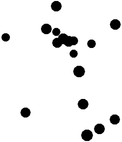

# Nonsymbolic Comparison task 

## In this experiment, you will compare two sets of dots like the ones below:

</img>

## Your task is to choose the *larger* set as fast and as accurate as you can!

## If the the **left** set is larger, press **F**.
## If the the **right** set is larger, press **J**.

