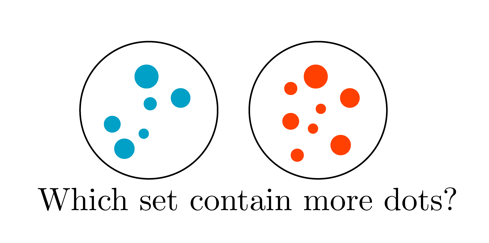
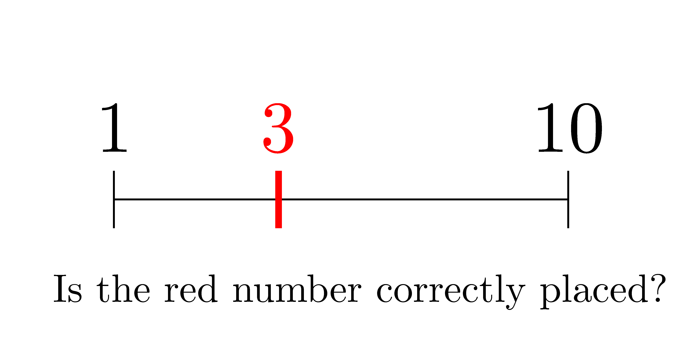

## Math Cognition Experiments

| **[Nonsymbolic comparison](https://run.pavlovia.org/isaackim/multitudes/task/comparison/?task=nonsymbolic)** | **[Symbolic comparison](https://run.pavlovia.org/isaackim/multitudes/task/comparison/?task=symbolic)** | **[Nonsymbolic estimation](/experiments/nonsymbolic_estimation.html)** | 
|:-------------:|:-------------:|:-------------:|
|  |    |    |

| **[Nonsymbolic Calculation](/experiments/nonsymbolic_calculation.html)** | **[Number line](https://run.pavlovia.org/isaackim/multitudes/task/numberline/)** | **[Symbol identification](/experiments/symbol_identification.html)** | 
|:-------------:|:-------------:|:-------------:|
|  |    |    |

| **[Approximate Calculation](/experiments/approximate_calculation.html)** | **[Exact Calculation](/experiments/exact_calculation.html)** | **[Geometrical reasoning](https://run.pavlovia.org/isaackim/multitudes/task/geometry/)** | 
|:-------------:|:-------------:|:-------------:|
|  |    |    |

