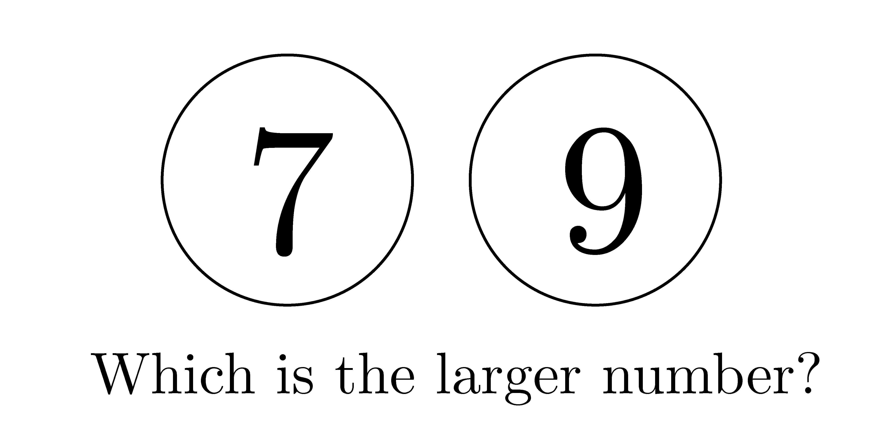

## Math Cognition Experiments

| **[Nonsymbolic comparison](/experiments/nonsymbolic_comparison.html)** | **[Symbolic comparison](/experiments/symbolic_comparison.html)** | **[Nonsymbolic estimation](/experiments/nonsymbolic_estimation.html)** | 
|:-------------:|:-------------:|:-------------:|
|  |    |    |

| **[Nonsymbolic Calculation](/experiments/nonsymbolic_calculation.html)** | **[Number line](/experiments/number_line.html)** | **[Symbol identification](/experiments/symbol_identification.html)** | 
|:-------------:|:-------------:|:-------------:|
|  |    |    |

| **[Approximate Calculation](/experiments/approximate_calculation.html)** | **[Exact Calculation](/experiments/exact_calculation.html)** | **[Geometrical reasoning](/experiments/geometrical_reasoning.html)** | 
|:-------------:|:-------------:|:-------------:|
|  |    |    |

